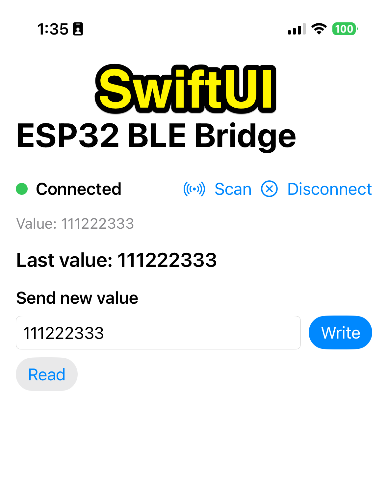
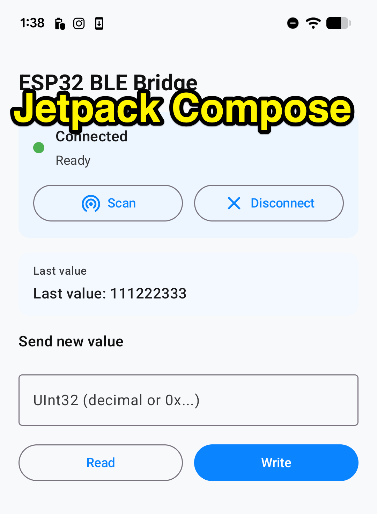

# BLE ESP32 Comm

Cross-platform BLE code example that demonstrates how to connect an iPhone or Android phone to an ESP32 using Bluetooth Low Energy. It shows a simple read/write flow by exchanging a single 32-bit integer and persisting that value on the ESP32 so it survives power cycles.

Includes:
- A SwiftUI iOS app that scans for an ESP32 peripheral, reads/writes a 32-bit value over BLE, and listens for notifications.
- An ESP32 firmware project that builds in both Arduino IDE and PlatformIO (shared source).
- Android clients (Compose + legacy Views) for parity testing.

Notes:
- You can only connect one device to the ESP32 at a time. Tap the "Disconnect" button on the currently connected device if you want to try it on a separate device.
- You can use the legacy Android build, but it's not being maintained or updated. The Jetpack Compose version is.
- Both Arduino IDE and PlatformIO reference the same .cpp file at [`esp32-firmware/shared/BLEMemoryBridge.cpp`](esp32-firmware/shared/BLEMemoryBridge.cpp)

## Compatibility
- Firmware: ESP32 Arduino core 3.x (Arduino IDE) or PlatformIO `espressif32` platform.
- Clients: iOS physical device (BLE required), Android 13+ physical device (BLE required).

## Known Issues
- ESP32 upload via PlatformIO can fail to connect; hold BOOT/IO0 or tap EN/RESET when “Connecting...” appears.

## Project Structure
- `BLE-ESPCom/` — iOS app. Open `BLE-ESPCom/BLE-ESPCom.xcodeproj` in Xcode. Sources live in `BLE-ESPCom/BLE-ESPCom/` (`ContentView.swift`, `BLEManager.swift`, `BLE_ESPComApp.swift`). Assets in `Assets.xcassets/`.
- `BLE-ESP32ComAndroid/` — Legacy Android (Views). Open in Android Studio. Layouts in `app/src/main/res/layout/` (`activity_main.xml`, `content_main.xml`, `drawable/status_dot.xml`); logic in `app/src/main/java/com/skyeroad/ble_esp32com/MainActivity.kt`.
- `BLEESP32ComJPC/` — Jetpack Compose Android app (Material 3, iOS-like palette). Entry: `app/src/main/java/com/skyeroad/ble_esp32comjpc/MainActivity.kt`; BLE logic in `ble/BleClient.kt` + `BleViewModel.kt`. MinSdk 33, targetSdk 36. Build with `./gradlew :app:assembleDebug`.
- `esp32-firmware/` — ESP32 firmware with shared sources for Arduino IDE + PlatformIO. See `esp32-firmware/README.md`.

## Screenshots
<table>
  <tr>
    <th>SwiftUI Screenshot</th>
    <th>Jetpack Compose Screenshot</th>
  </tr>
  <tr>
    <td></td>
    <td></td>
  </tr>
</table>

## BLE Contract (shared IDs)
- Service UUID: `d973f2b9-2ed7-4d5b-ad07-4d1974f2c925`
- Characteristic UUID: `d973f2b9-2ed7-4d5b-ad07-4d1974f2c926`
- Data: 32-bit unsigned integer, little-endian. Notifications sent after writes.

## Running the iOS App
1. Open `BLE-ESPCom/BLE-ESPCom.xcodeproj` in Xcode.
2. Build/run on a physical device (BLE is not available in the simulator) — ⌘R.
3. Tap **Scan** to find the ESP32 (`ESP32 Memory Bridge`), connect, then **Read** or enter a value and **Write**.

## Running the Android Apps
- **Compose app (recommended):** open `BLEESP32ComJPC/` in Android Studio or run `./gradlew :app:assembleDebug`. Use a physical device (BLE not available on the emulator), MinSdk 33. Main screen mirrors the iOS layout: status dot + state, Scan/Disconnect row, “Last value” card, numeric input + Write/Read buttons. BLE filtering by service UUID; notifications update the last value text.
- **Legacy views app:** open `BLE-ESP32ComAndroid/` if you need the original XML-based UI. Physical device required; same BLE behavior and UUIDs.

## ESP32 Firmware (Arduino IDE + PlatformIO)
The firmware is a shared codebase located in `esp32-firmware/shared/` with thin entry points for each build system.

### Arduino IDE
1. Open `esp32-firmware/arduino/BLEMemoryBridge/BLEMemoryBridge.ino` in Arduino IDE.
2. Select your ESP32 board and port, then **Upload**.
3. Defaults to value `0x12345678`, persisted to NVS; re-advertises automatically after disconnects.

### PlatformIO
1. Open `esp32-firmware/platformio/` in PlatformIO.
2. Build: `pio run`
3. Upload: `pio run -t upload`
4. Serial monitor: `pio device monitor -b 115200`

If upload fails to connect, hold the BOOT/IO0 button while the upload begins or tap EN/RESET when you see “Connecting...”. If PlatformIO picks the wrong port, pass it explicitly, for example: `pio run -t upload --upload-port /dev/cu.usbserial-0001`.

## Notes
- Keep UUIDs in sync if you change them in either side.
- Use a BLE explorer (nRF Connect, LightBlue) for quick validation.
- ESP32 default firmware supports a single central at a time; allowing multiple centrals would require increasing NimBLE connection limits on the firmware and validating memory/performance.
